# OASES
**My final project for [Stanford Society of Women Engineers](https://swe.stanford.edu/)' OASES program.**  
**Shortcuts: [About](https://github.com/kayleyseow/OASES#about), [Cigar Box Guitar](https://github.com/kayleyseow/OASES#cigar-box-guitar), [Photos](https://github.com/kayleyseow/OASES#photos), [Arduino](https://github.com/kayleyseow/OASES#arduino), [Materials List](https://github.com/kayleyseow/OASES#materials-list), [Code](https://github.com/kayleyseow/OASES#code), [Photos and Demo](https://github.com/kayleyseow/OASES#photos-and-demo), [Further Hacking](https://github.com/kayleyseow/OASES#further-hacking)**  

## About
Over the course of the Outreach for Students in Engineering and Science program, I completed a final project under the guidance of my undergraduate engineering student mentor at the Stanford Product Realization Lab. During the yearlong program, I learned about different fields of engineering and the engineering design process, and gained experience with practical skills, like woodworking and circuitry.  
<p align="center">
	
	 
	
	<br>
	<b>Photos with my OASES cohort and mentors.</b>
</p>  

# Cigar Box Guitar
As part of my final project at OASES, I built a guitar out of a cigar box. At the Stanford Product Realization Lab, I fabricated the guitar, using machinery to cut the cigar box body and construct the neck of the guitar. We used screws, bolts and a toothpick to serve as the nut and bridge of the guitar. I got the tuning pegs and strings from a guitar kit and in the end, we were able to tune and play our guitar. 
## Photos  
<p align="center">
	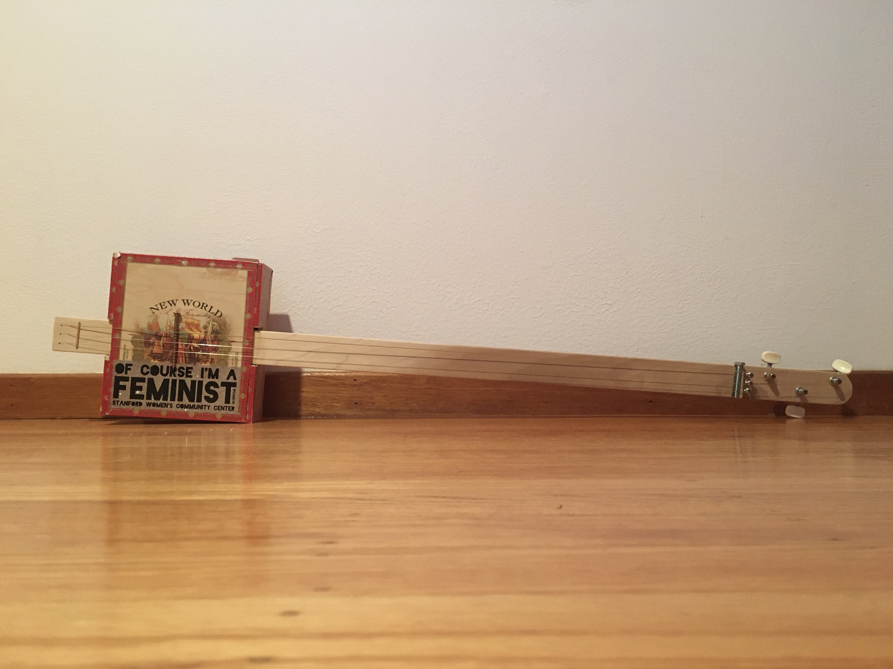
	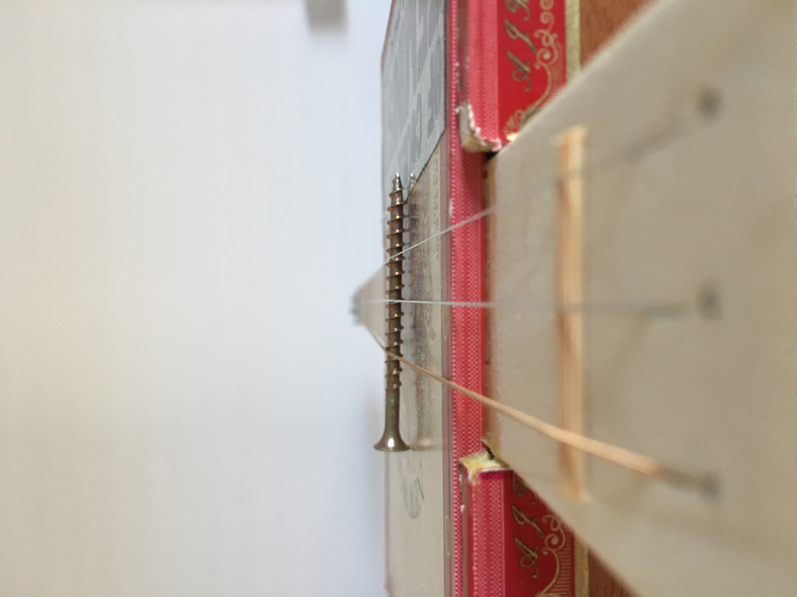
	<br>
	<b>Photos of the guitar and bridge.</b>
	<br>
	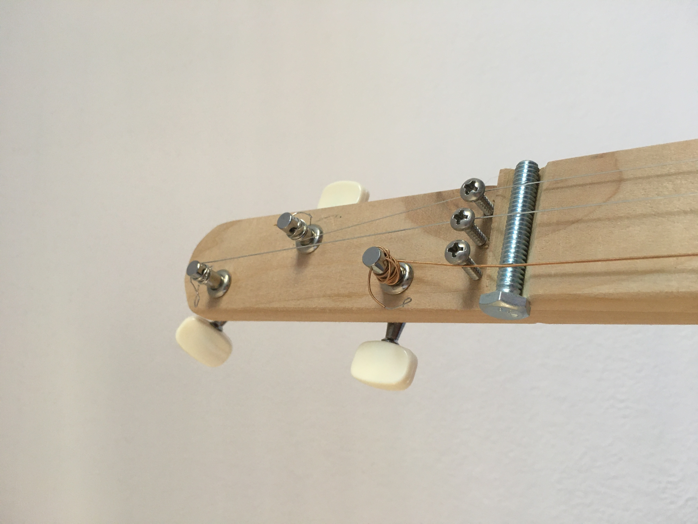
	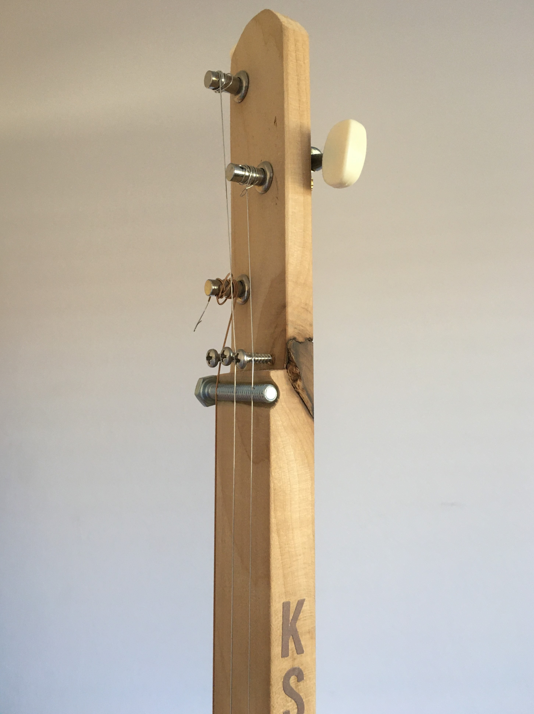
	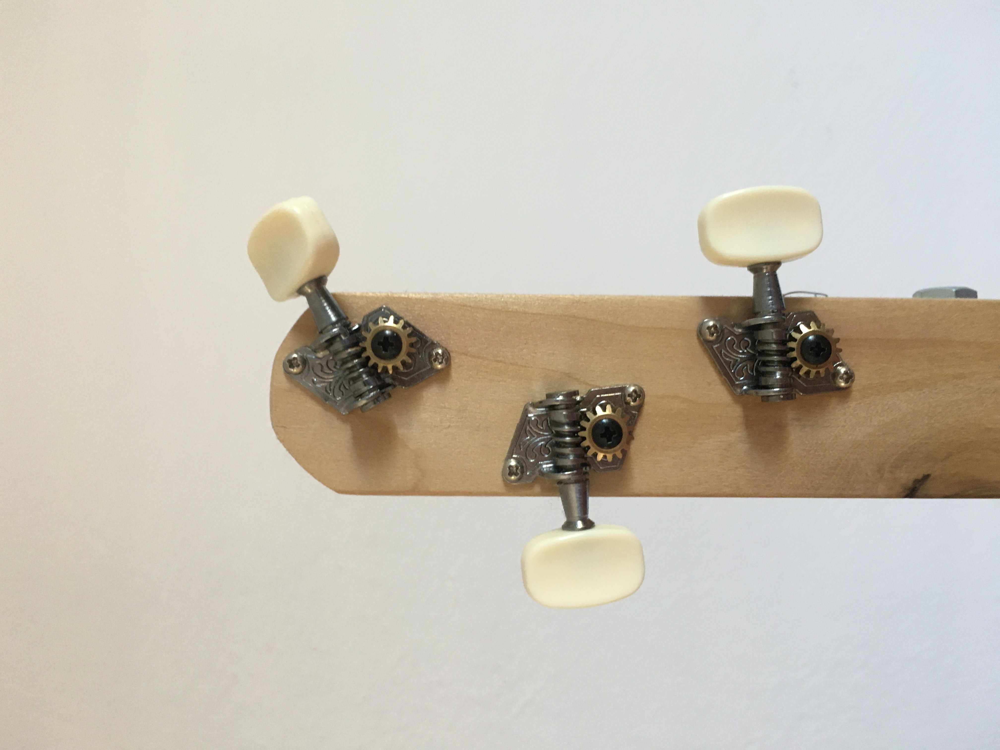 
	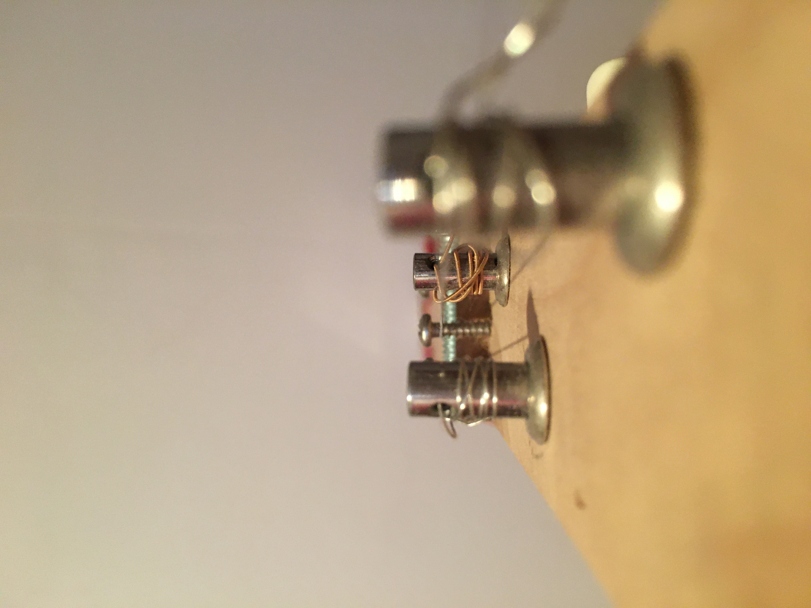
	<br>
	<b>Photos of the guitar head, tuning keys, and headstock.</b>
</p>  

# Arduino
The code for the Arduino is in the [ledcontrol.ino](https://github.com/kayleyseow/OASES/blob/master/ledcontrol.ino) file. This code controls the intensity of the LED lights based on the input from the audio sensor. The content here is modified from SWE material.
## Materials List  
- 1 Arduino Uno
	- 1 Breadboard
	- USB Cable
- Sound Sensor
- 10 LEDs
- 10 4-Band Resistors
  - From our materials, I chose the resistors with 330 Ohms with ± 5% Tolerance (Orange Orange Brown Gold)
- 10 Jumper Wires
## Code
This section goes into detail about the specifics of the Arduino and the logic of the code behind it. If there are questions that the code's comments cannot answer, chances are you will find the answer here.  
Code TL;DR: `if` the input from the sensor is above the `threshold` value, then the light will be turned on. `else`, the light will be turned off.  
### LED's  
- Arduino Digital Pin → Positive Side of LED → Negative Side of LED → resistor → Arduino Ground Pin (GND).
- In ```void setup()```, the ```pinMode``` functions (for example, ```pinMode(3, OUTPUT);```), initialize the pins on the Arduino. In this case, it sets up pin `3` as `output`.
- In ```void loop()```, the ```digitalWrite``` functions control the state of the individual LED lights. For example, ```digitalWrite(3, HIGH);``` sets pin `3` to `HIGH`, which just means that the light is turned on. The opposite, ```digitalWrite(3, LOW);``` would turn the light at pin `3` to `LOW`, essentially turning it off.
### Sound Sensor
- Analog VS Digital:  
	- An analog signal is one that can take on any number of values, unlike a digital signal which has only two values: ```HIGH``` and ```LOW```.  
	- Your sound sensor, and most other sensors, are based on analog values.
- This should be connected to the analog input 0 on the Arduino(A0). GND is connected to ground. VCC is connected to +5V. DO – which is the digital output of the module, and should be connected to digital pin 2 on the Arduino.
- Global variables:
  - ```int DO = 2;``` sets a pin to receive digital output.
  - ```int DA = A0;``` sets the pin to receive analog output.
  - ```int threshold = 263;``` sets a minimum threshold for LED lit.
    - Remember to set the threshold a bit higher than the average values you get from the sensor.
  - ```int sensorvalue = 0;``` initializes the variable for later use.
- ```void setup()```
  - ```Serial.begin(9600);```
    - Initializes the serial connection at 9600 bits per second.
    - That is a bit of data every 1/9600 of a second.
- ```void loop()```  
  - The first 6 lines read the value given by the sensor.  
  - ```sensorvalue = analogRead(DA);``` reads the analog value.
  - ```Serial.print(sensorvalue);``` prints the analog value.
  - ```Serial.println(digitalRead(DO));``` prints the digital value.
## Photos and Demo
**Demo: The link to the video demo of this Arduino is [here](https://youtu.be/_N_22f2PsdY).**  
**Photos:**
<p align="center">
	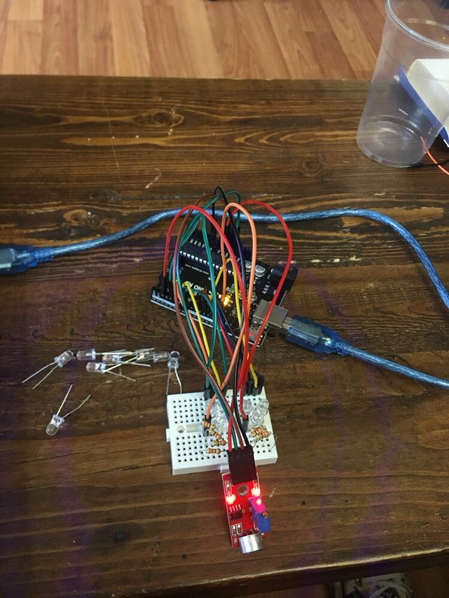
	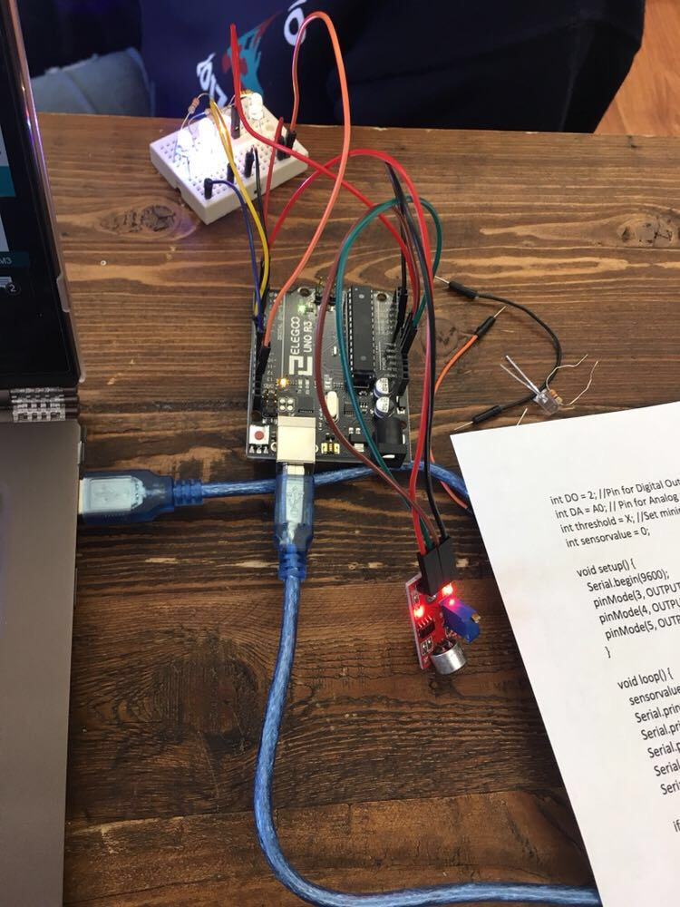
	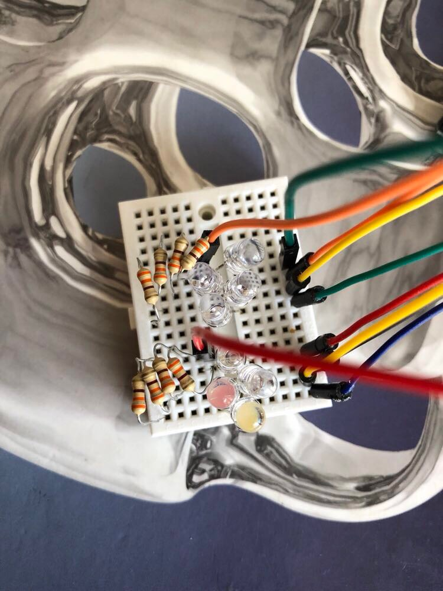
	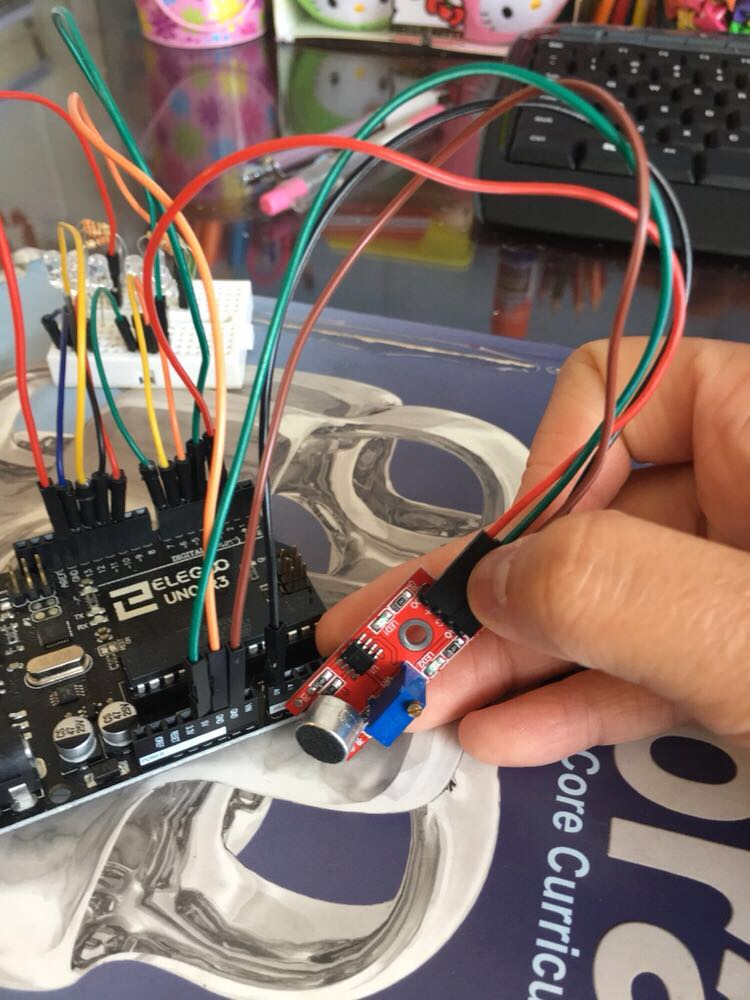
	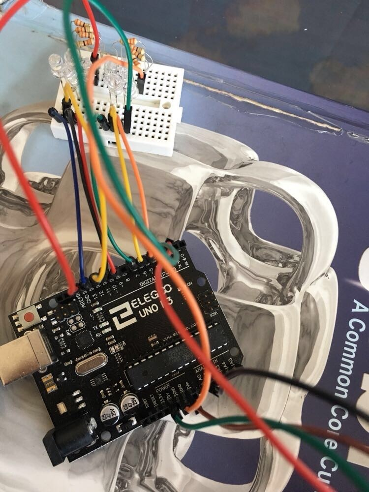
	<br>
	<b>Photos of the Arduino being built and tested, the breadboard, audio sensor, and the full setup.</b>
</p>

## Running the Arduino
1. Run code
2. Press the magnifying glass (serial monitor) in the top right corner
3. Look at the given analog values
4. Estimate a minimum value for the threshold when the room is quiet (should be around 250). Remember to set the minimum value for the threshold higher than the ones you see in order for a change in sound to make a visible change
5. If sensor is not near that value, adjust its sensitivity by turning the knob on the blue box until it is closer
6. Play music or talk into the mic or tap it to see how the LEDs change
## Further Hacking
- Wire as many LEDs as you can wire onto your board
- Create a parallel LED circuit and/or create a series LED circuit
	- How are they different?
- Find a song and respective sensitivity that makes a super lit LED pattern/visualization
- Add a non-LED component into your circuit
- Combine guitar and circuit
